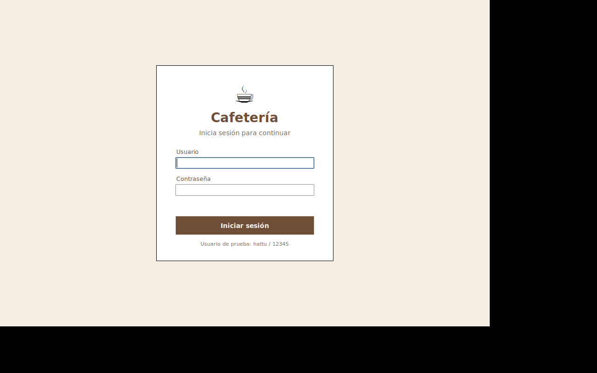
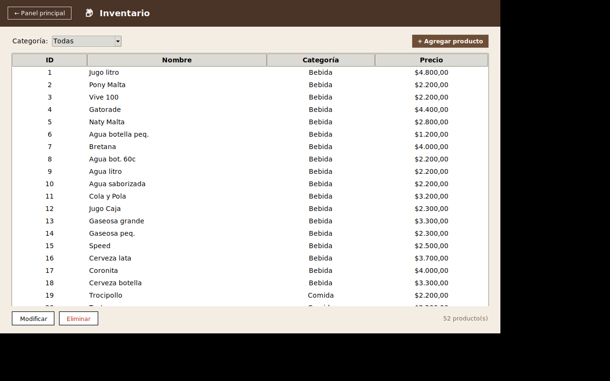
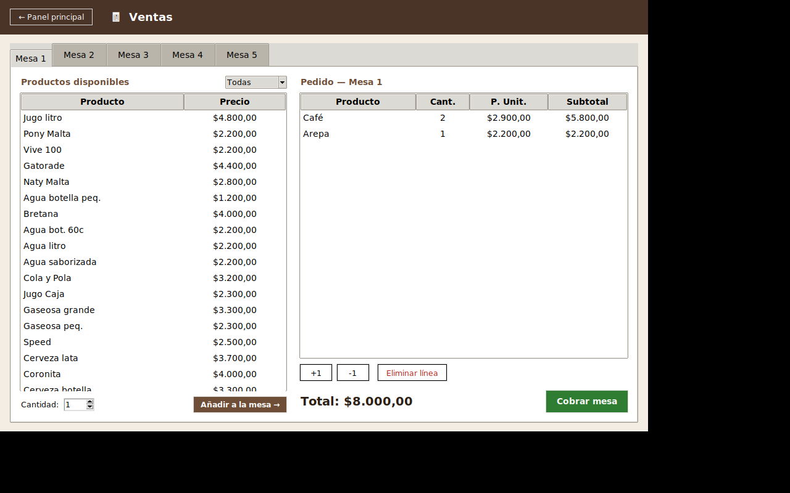
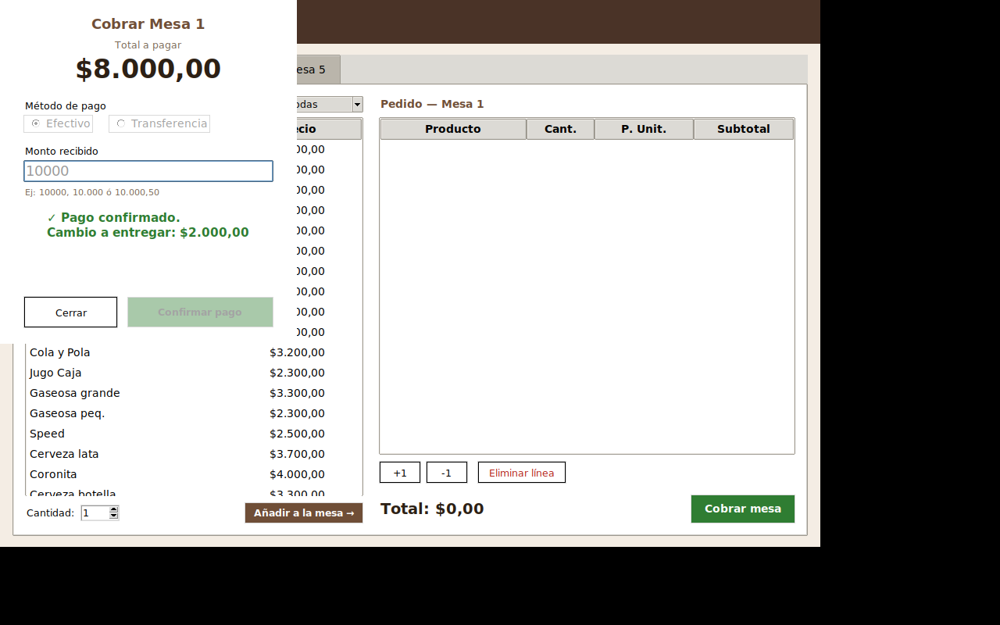
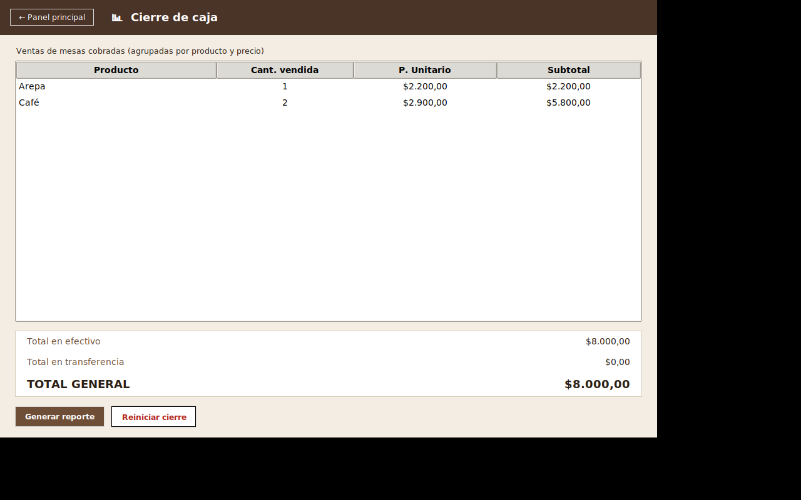

# Guía de uso — Cafetería (Sistema de Ventas)

Guía paso a paso para usar la aplicación. Si buscas documentación técnica
(estructura de archivos, módulos, decisiones de diseño), revisa
[README.md](README.md).

---

## Antes de empezar

**Requisitos:** Python 3.8 o superior. En Linux, si la aplicación no
abre y el error menciona "tkinter" o "_tkinter", instala:

```bash
sudo apt-get install python3-tk
```

**Para abrir la aplicación**, desde la carpeta `cafeteria_app`:

```bash
python3 main.py
```

---

## 1. Iniciar sesión

Al abrir la aplicación verás la pantalla de inicio de sesión.



Usuario y contraseña son fijos:

- **Usuario:** `hattu`
- **Contraseña:** `12345`

Si te equivocas, la aplicación te lo indica claramente y puedes
intentarlo de nuevo sin límite de intentos.

---

## 2. Panel principal

Después de iniciar sesión llegas al panel principal, con acceso directo a
las tres secciones de la aplicación. Haz clic en cualquiera de las tres
tarjetas para entrar.


Desde cualquier pantalla puedes volver aquí con el botón **"← Panel
principal"** de la barra superior, y cerrar la sesión con el botón
**"Cerrar sesión"** de esta pantalla.

---

## 3. Inventario

Aquí administras el catálogo completo de productos de la cafetería.



- **Filtrar por categoría:** usa el menú desplegable "Categoría" arriba
  a la izquierda (*Todas*, *Bebida*, *Comida*).
- **Agregar un producto:** botón **"+ Agregar producto"** (arriba a la
  derecha). Escribe nombre, elige categoría y escribe el precio.
- **Modificar un producto:** selecciónalo en la tabla (un clic) y pulsa
  **"Modificar"**, o simplemente haz doble clic sobre la fila.
- **Eliminar un producto:** selecciónalo y pulsa **"Eliminar"**. Se te
  pedirá confirmación. Eliminar (o modificar el precio de) un producto
  **nunca** afecta los pedidos que ya estén en una mesa: esos pedidos
  quedan con el nombre y el precio que tenían en el momento en que se
  agregaron.

**Formatos de precio aceptados** al agregar o modificar un producto (los
mismos que en el cobro, ver sección 5):

| Escribes | Se interpreta como |
|---|---|
| `10000` | $10.000 |
| `10.000` | $10.000 |
| `10.000,50` | $10.000,50 |
| `$10.000,50` | $10.000,50 |

---

## 4. Ventas — atender una mesa

Hay 5 mesas disponibles, cada una con su propio pedido, organizadas en
pestañas (Mesa 1 a Mesa 5).



**Para armar un pedido:**

1. Elige la pestaña de la mesa que quieres atender.
2. En la lista de la izquierda ("Productos disponibles") selecciona un
   producto. Puedes filtrar por categoría igual que en Inventario.
3. Ajusta la cantidad con el control "Cantidad" si necesitas más de 1.
4. Pulsa **"Añadir a la mesa →"** (o haz doble clic sobre el producto).
5. El producto aparece en la tabla de la derecha ("Pedido"), con su
   precio unitario y subtotal. El total de la mesa se actualiza abajo.

**Para ajustar el pedido ya armado:**

- Selecciona una línea del pedido y usa **"+1"** / **"-1"** para subir o
  bajar la cantidad (si llega a 0, la línea se elimina sola).
- O usa **"Eliminar línea"** para quitarla de una vez.

Cada mesa es completamente independiente: lo que agregues en Mesa 1 no
afecta a las demás.

---

## 5. Cobrar una mesa

Cuando el pedido esté listo, pulsa **"Cobrar mesa"** (verde, abajo a la
derecha del pedido).



1. Verás el **total a pagar**.
2. Elige el **método de pago**:
   - **Efectivo:** escribe el monto que te entregó el cliente. Acepta
     estos formatos indistintamente: `10000`, `10.000`, `10,000`,
     `10.000,50`, `$10.000,50`. Si el monto es menor al total, la
     aplicación no te deja continuar y te dice exactamente cuánto falta.
     Si es suficiente, calcula el cambio exacto a entregar.
   - **Transferencia:** el campo se llena solo con el total exacto y no
     se puede editar; no hay cambio que calcular.
3. Pulsa **"Confirmar pago"**.

Al confirmar, la venta queda registrada en el Cierre y **la mesa se
libera de inmediato**, lista para nuevos clientes — verás que su pedido
vuelve a aparecer vacío apenas cierras el diálogo de cobro.

---

## 6. Cierre de caja

Aquí ves el resumen de todo lo vendido en las mesas ya cobradas.



- La tabla agrupa las ventas por producto (y por precio, si un mismo
  producto se vendió a precios distintos porque cambiaste su precio en
  Inventario entre una venta y otra).
- Abajo ves el **total en efectivo**, el **total en transferencia** y el
  **total general**.
- **"Generar reporte"** guarda un archivo de texto con este mismo
  resumen (se te preguntará dónde guardarlo).
- **"Reiniciar cierre"** borra el historial de ventas cobradas y deja las
  5 mesas libres, pero **no toca el inventario** — úsalo, por ejemplo,
  al empezar un nuevo turno o un nuevo día. Se te pedirá confirmación
  antes de aplicarlo, porque no se puede deshacer.

---

## Flujo típico completo

1. Iniciar sesión (`hattu` / `12345`).
2. Revisar o ajustar precios en Inventario si hace falta.
3. Ir a Ventas, elegir una mesa y añadir los productos que pidió el
   cliente.
4. Cobrar la mesa (efectivo o transferencia).
5. Repetir con las demás mesas durante el turno.
6. Al cerrar el turno: ir a Cierre, revisar los totales, generar el
   reporte si lo necesitas, y reiniciar el cierre para el siguiente
   turno.

---

## Preguntas frecuentes

**¿Puedo perder datos si cierro la aplicación de golpe?**
No debería: cada cambio se guarda inmediatamente en disco (no hay un
botón de "guardar" aparte), y la escritura está diseñada para no dejar
archivos a medio escribir aunque la aplicación se cierre abruptamente.

**Escribí un precio y me dice "Formato no aceptado", ¿qué hice mal?**
Revisa que sólo tenga números, puntos y comas (sin letras ni espacios
internos, aparte del símbolo `$` que sí se acepta). Ejemplos válidos:
`2900`, `2.900`, `2900,50`.

**¿Puedo tener más de un producto con el mismo nombre?**
La aplicación no lo impide, pero no es recomendable: cada producto es
independiente aunque tengan el mismo nombre (tienen distinto id).

**Eliminé un producto por error, ¿los pedidos que ya lo tenían se
dañan?**
No. Los pedidos ya armados guardan su propia copia del nombre y el
precio, independiente del inventario.

**¿Cómo restauro el inventario a como venía originalmente?**
Corre `python3 seed_inventario.py` desde la carpeta del proyecto. Esto
reemplaza por completo `data/json/inventario.json` con los 52 productos
originales; no afecta mesas ni cierre.
