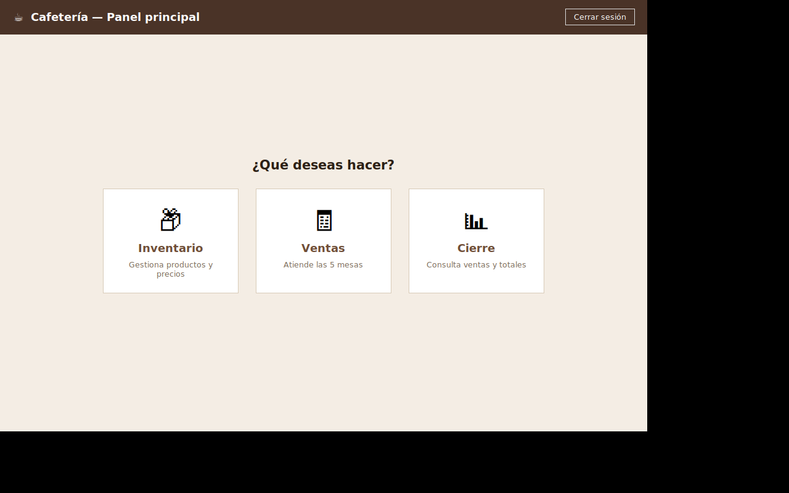

# Cafetería — Sistema de Ventas (Python)

Reescritura completa en **Python** del sistema de ventas de la cafetería que
antes existía en Java. Implementa inicio de sesión, inventario, ventas en 5
mesas, cobro (efectivo/transferencia) y cierre de caja, con persistencia en
archivos **JSON** y manejo **exacto** de dinero con `decimal.Decimal`.



---

## 1. Cómo ejecutar la aplicación

**Requisitos:** Python 3.8 o superior.

En Windows y macOS, Tkinter viene incluido con Python. En Linux puede que
debas instalarlo aparte:

```bash
# Ubuntu / Debian
sudo apt-get install python3-tk
```

**Ejecutar:**

```bash
cd cafeteria_app
python3 main.py
```

No hay dependencias externas que instalar (`pip install` no es necesario):
todo el proyecto usa exclusivamente la biblioteca estándar de Python
(`tkinter`, `decimal`, `json`, `datetime`, `unittest`).

**Iniciar sesión con:** usuario `hattu`, contraseña `12345` (credenciales
fijas, tal como lo pide el enunciado).

Al ejecutar por primera vez, la aplicación ya trae cargado el inventario
inicial de la cafetería (52 productos, ver sección 6). Si en algún momento
quieres restaurar el inventario a ese estado inicial, corre:

```bash
python3 seed_inventario.py
```

(Esto sólo reemplaza `data/json/inventario.json`; no toca mesas ni cierre.)

---

## 2. Estructura del proyecto

```
cafeteria_app/
├── main.py                  # Punto de entrada
├── seed_inventario.py       # Utilidad para (re)cargar el inventario inicial
├── README.md                # Este documento
├── GUIA_USUARIO.md          # Guía de uso paso a paso
├── capturas/                # Capturas de pantalla de referencia
├── recursos/
│   └── LISTA_PRECIOS_CAFE.xlsx   # Lista de precios original (fuente del inventario inicial)
├── data/
│   └── json/
│       ├── inventario.json  # Productos
│       ├── mesas.json       # Las 5 mesas y sus pedidos
│       └── cierre.json      # Historial de ventas cobradas y totales
├── core/                    # LÓGICA DE NEGOCIO (sin ninguna dependencia de Tkinter)
│   ├── money.py             # Parseo/formateo exacto de montos
│   ├── persistence.py       # Lectura/escritura atómica de JSON
│   ├── inventario.py        # Gestión de productos
│   ├── mesas.py             # Gestión de las 5 mesas y sus pedidos
│   ├── cierre.py            # Historial de ventas cobradas y totales
│   └── controller.py        # Fachada que coordina todo lo anterior
├── gui/                     # INTERFAZ GRÁFICA (Tkinter)
│   ├── app.py                 # Ventana raíz y navegación entre pantallas
│   ├── estilos.py              # Colores/fuentes compartidos
│   ├── login_view.py           # Pantalla de login
│   ├── principal_view.py       # Panel principal (navegación)
│   ├── inventario_view.py      # Pantalla de inventario + diálogo agregar/modificar
│   ├── ventas_view.py          # Pantalla de ventas (5 mesas en pestañas)
│   └── cierre_view.py          # Pantalla de cierre
└── tests/
    └── test_core.py          # 42 pruebas automatizadas de toda la lógica de negocio
```

**Separación de responsabilidades:** ningún archivo dentro de `core/`
importa nada de `gui/`, ni sabe que Tkinter existe. Toda la lógica de
negocio (validaciones, cálculos, persistencia) vive en `core/` y se puede
probar —y de hecho se prueba, ver sección 7— sin abrir ninguna ventana.
`gui/` sólo se encarga de mostrar datos y traducir clics en llamadas al
`AppController`.

---

## 3. Qué hace cada módulo

### `core/money.py` — Dinero exacto
Ver sección 5 más abajo: es el módulo más delicado del proyecto, porque de
él depende que la caja siempre cuadre.

### `core/persistence.py` — Lectura/escritura de JSON
Centraliza el acceso a los 3 archivos de datos. Dos decisiones clave:

- **Rutas absolutas basadas en la ubicación del propio archivo**
  (`core/persistence.py`), no en el directorio desde el que se ejecute
  `main.py`. Así `data/json/` siempre se resuelve correctamente sin
  importar desde dónde se lance la aplicación.
- **Escritura atómica:** cada guardado escribe primero a un archivo
  temporal (`*.tmp`) en la misma carpeta y luego lo reemplaza con
  `os.replace()`, que en Windows, macOS y Linux es una operación atómica a
  nivel de sistema de archivos. Esto evita que un corte de energía o un
  cierre inesperado de la aplicación a mitad de una escritura deje un JSON
  corrupto a medias. Si de todas formas un archivo llega a corromperse
  (por edición manual, por ejemplo), se respalda como `archivo.json.bak` y
  la aplicación sigue funcionando con datos por defecto en vez de fallar.

### `core/inventario.py` — Módulo de Inventario
Clase `Inventario`: agregar, modificar, eliminar y listar productos
(con filtro por categoría). Cada producto tiene `id`, `nombre`,
`categoria` (`"Bebida"` o `"Comida"`) y `precio` (`Decimal`).

### `core/mesas.py` — Módulo de Mesas y pedidos
Clase `Mesas`: gestiona las 5 mesas (`mesa1`...`mesa5`), cada una con su
lista independiente de productos añadidos, cantidad, precio unitario
congelado y subtotal. Aquí vive la regla del **precio congelado**
(sección 8).

### `core/cierre.py` — Módulo de Cierre
Clase `Cierre`: acumula el **historial completo** de líneas vendidas (no
sólo totales) de las mesas efectivamente cobradas, agrupa por producto y
precio para el resumen, calcula totales por método de pago, genera el
reporte de texto y soporta el reinicio de cierre.

### `core/controller.py` — Controlador central
Clase `AppController`: es la única puerta de entrada que usa la interfaz
gráfica. Coordina `Inventario`, `Mesas` y `Cierre` para las operaciones que
tocan más de un módulo a la vez (por ejemplo, `cobrar_mesa` registra la
venta en `Cierre` y libera la mesa en `Mesas` en una sola llamada).

### `gui/*` — Interfaz gráfica (Tkinter)
- `app.py`: ventana raíz; crea el `AppController` una sola vez y cambia
  entre pantallas (frames superpuestos, patrón estándar de Tkinter).
- `login_view.py`, `principal_view.py`, `inventario_view.py`,
  `ventas_view.py`, `cierre_view.py`, `cobro_dialog.py`: una pantalla o
  diálogo cada uno, con navegación clara entre Inventario, Ventas y
  Cierre tal como pide el enunciado.

---

## 4. Estructura de los archivos JSON

### `data/json/inventario.json` — arreglo de productos

```json
[
  {
    "id": 49,
    "nombre": "Café",
    "categoria": "Bebida",
    "precio": "2900.00"
  }
]
```

### `data/json/mesas.json` — objeto con las 5 mesas

```json
{
  "mesa1": {
    "productos": [
      {
        "idProducto": 49,
        "nombre": "Café",
        "cantidad": 2,
        "precioUnitario": "2900.00"
      }
    ],
    "pagada": false,
    "metodoPago": null,
    "totalPagado": "0.00"
  },
  "mesa2": { "productos": [], "pagada": false, "metodoPago": null, "totalPagado": "0.00" },
  "mesa3": { "...": "..." },
  "mesa4": { "...": "..." },
  "mesa5": { "...": "..." }
}
```

> Nota: justo después de un cobro exitoso, la venta ya quedó registrada en
> `cierre.json` y la mesa se reinicia de inmediato a su estado vacío
> (`productos: []`, `pagada: false`) para quedar libre para el siguiente
> cliente, tal como pide el enunciado ("La mesa queda libre de nuevo para
> nuevos clientes tras cobrarse").

### `data/json/cierre.json` — historial + totales

```json
{
  "ventas": [
    {
      "nombreProducto": "Café",
      "cantidad": 2,
      "precioUnitario": "2900.00",
      "subtotal": "5800.00",
      "mesa": "mesa1",
      "metodoPago": "efectivo",
      "fecha": "2026-08-08T21:45:49"
    }
  ],
  "totalEfectivo": "5800.00",
  "totalTransferencia": "0.00",
  "totalGeneral": "5800.00",
  "fechaCierre": null
}
```

`ventas` guarda el **desglose histórico completo**: cada línea cobrada,
con su precio unitario y subtotal reales en el momento de la venta — esto
corrige explícitamente la falencia que tenía `Cierre.java` en el sistema
original (no guardaba precios unitarios ni subtotales, sólo totales).

**Por qué los montos se guardan como texto (`"2900.00"`) y no como número
JSON:** JSON no tiene un tipo decimal exacto; sus números son floats de
doble precisión. Guardar `"2900.00"` como string y reconstruirlo con
`Decimal("2900.00")` al leer garantiza una ida y vuelta (round-trip)
perfecta, sin ningún riesgo de que aparezcan errores de redondeo binario
al cargar el archivo.

---

## 5. Manejo de dinero: decisiones y formatos aceptados

### Por qué `Decimal` y nunca `float`

Los `float` de Python (y de casi todos los lenguajes) están en base 2, y
muchas cantidades "exactas" en base 10 —como 0.10 o 0.20— no tienen una
representación exacta en base 2. Por ejemplo, en Python:

```python
>>> 0.1 + 0.2
0.30000000000000004
```

En una caja registradora esos errores diminutos se **acumulan** con cada
operación y eventualmente producen descuadres reales entre lo que el
sistema dice que se cobró y lo que efectivamente se cobró. Por eso, en
**todo** el proyecto (`money.py`, `inventario.py`, `mesas.py`, `cierre.py`,
`controller.py`) los precios, subtotales y totales son siempre
`decimal.Decimal`, redondeados a 2 decimales con `ROUND_HALF_UP`. Los
`float` no aparecen en ningún cálculo monetario; sólo se usa texto (para
leer/mostrar) y `Decimal` (para calcular).

### Formatos de monto aceptados (`core/money.py: parse_monto`)

La función central `parse_monto(texto)` interpreta lo que la persona
escribe en el campo de monto recibido (o de precio de un producto) y
devuelve `(Decimal, None)` si es válido o `(None, "mensaje de error")` si
no lo es. Acepta exactamente los formatos pedidos en el enunciado:

| Entrada | Resultado | Motivo |
|---|---|---|
| `10000` | `$10.000,00` | Entero simple, sin separadores |
| `10.000` | `$10.000,00` | Un solo separador seguido de 3 dígitos → se interpreta como **miles** |
| `10,000` | `$10.000,00` | Igual que arriba, con coma como alternativa |
| `10.000,50` | `$10.000,50` | Dos separadores: el de más a la derecha (`,`) es el decimal; el otro (`.`), miles |
| `10,000.50` | `$10.000,50` | Igual que arriba pero al estilo estadounidense (`.` decimal, `,` miles) |
| `$10.000,50` | `$10.000,50` | El símbolo `$` (y espacios) se ignoran |
| `10.5` / `10,50` | `$10,50` | Un solo separador seguido de 1–2 dígitos → se interpreta como **decimal** |
| `1.234.567,89` | `$1.234.567,89` | Miles agrupados varias veces + decimales |
| `abc123` | inválido: *"Formato no aceptado"* | Contiene caracteres no numéricos |
| *(vacío)* | inválido: *"Campo vacío."* | — |
| `-500` | inválido: *"El monto debe ser positivo."* | — |
| `0` | inválido: *"El monto debe ser mayor que cero."* | — |
| `10.1234` | inválido: *"El monto admite máximo 2 decimales."* | 4 dígitos decimales reales (no es una agrupación de miles) |

**Regla de desambiguación** cuando el texto sólo trae **un** tipo de
separador (sección 5 del enunciado, casos `10.000` vs. `10,000`): si el
separador va seguido de un grupo de **exactamente 3 dígitos** (y los
demás grupos, si hay varios, también tienen máximo 3 dígitos), se
interpreta como separador de **miles**, porque en pesos colombianos nunca
se usan 3 cifras decimales. En cualquier otro caso (1 ó 2 dígitos después
del separador) se interpreta como separador **decimal**. Cuando aparecen
**los dos** separadores en el mismo texto, el que está más a la derecha
siempre es el decimal (estándar tanto en el formato latino `10.000,50`
como en el estadounidense `10,000.50`).

Esta misma función se usa en **dos lugares**: al escribir el precio de un
producto en Inventario, y al escribir el monto recibido en el panel de
Cobro — así el comportamiento es idéntico en ambos formularios.

### Reglas del panel de cobro

- **Efectivo:** el monto recibido se valida con `parse_monto`. Si
  `recibido < total`, se bloquea con el mensaje exacto pedido en el
  enunciado: *"Monto insuficiente. Falta: $X"*. El cambio se calcula como
  `recibido - total`, con precisión decimal exacta.
- **Transferencia:** el campo se autocompleta con el total y queda
  deshabilitado (no editable); no hay cambio.

---

## 6. Inventario inicial

`data/json/inventario.json` se generó a partir de `LISTA_PRECIOS_CAFE.xlsx`
(incluido en `recursos/` como referencia) usando `seed_inventario.py`, con
52 productos (26 Bebida / 26 Comida).

**Nota importante:** la lista de precios original sólo trae *Producto* y
*Precio*, sin columna de categoría — el enunciado exige que cada producto
tenga `categoria` = `"Bebida"` o `"Comida"` (sección 2.2), así que cada uno
de los 52 productos se clasificó manualmente según su naturaleza. La
enorme mayoría es evidente (jugos, gaseosas y cervezas → Bebida;
paquetes, galletas y dulces → Comida), pero **dos productos no encajan
realmente en ninguna categoría** porque no son ni comida ni bebida:

- **"Cigarro"**
- **"Rollo papel H."** (papel higiénico)

Como el enunciado sólo contempla esas dos categorías, ambos quedaron
clasificados por defecto como `"Comida"` (la que no es bebida). Si
prefieres tratarlos distinto —o simplemente quitarlos del catálogo—, se
pueden reclasificar o eliminar en segundos desde la pantalla de
Inventario, sin tocar código.

---

## 7. Pruebas automatizadas

`tests/test_core.py` contiene **42 pruebas** (módulo estándar
`unittest`, sin dependencias externas) que cubren:

- Los **8 "casos de prueba clave"** listados textualmente en la sección 8
  del enunciado, de punta a punta (login → mesa → cobro → cierre →
  reinicio → persistencia real en disco).
- Las 15 validaciones de formato de monto de la sección 5 (incluye además
  casos extra: formato estadounidense, miles agrupados varias veces,
  decimales con coma, más de 2 decimales, monto negativo, monto cero).
- Las reglas de negocio críticas de la sección 4: precio congelado al
  agregar a una mesa, un producto eliminado del inventario no afecta
  pedidos ya creados, el cierre sólo incluye mesas pagadas, reiniciar
  cierre dejando mesas libres sin tocar inventario, agrupación de ventas
  por producto y precio cuando el precio cambió entre una venta y otra.
- Reglas de Inventario (filtro por categoría, categoría inválida
  rechazada, unicidad de id) y de Mesas (mesas independientes entre sí,
  suma de cantidad al repetir un producto al mismo precio, cantidades
  inválidas rechazadas).

Ejecutar todas las pruebas desde la raíz del proyecto:

```bash
python3 -m unittest tests.test_core -v
```

Salida esperada: `Ran 42 tests ... OK`. Las pruebas usan archivos JSON
temporales (no tocan `data/json/`), así que se pueden correr tantas veces
como se quiera sin afectar los datos reales de la aplicación.

---

## 8. Reglas de negocio críticas y cómo se garantizan

| Regla (enunciado, sección 4) | Cómo se garantiza |
|---|---|
| No usar floats para dinero | `Decimal` en cada cálculo monetario de `core/`; ver sección 5 |
| Precio congelado al agregar a una mesa | `Mesas.agregar_producto` copia `producto["precio"]` dentro de la línea (`precioUnitario`) en el momento de agregar; nunca vuelve a leer el inventario después |
| Modificar/eliminar un producto no afecta pedidos existentes | Las líneas de mesa sólo guardan `nombre` y `precioUnitario` propios; `Inventario.modificar/eliminar` no tocan `mesas.json` en absoluto |
| El cierre sólo incluye mesas pagadas | `Cierre.registrar_venta` sólo se llama desde `AppController.cobrar_mesa`, tras validar el pago exitosamente |
| Reiniciar cierre borra ventas y libera mesas, pero no toca inventario | `AppController.reiniciar_cierre` llama sólo a `Cierre.reiniciar()` y `Mesas.liberar_todas()`; nunca importa ni usa `Inventario` |
| Validaciones claras: monto inválido / insuficiente / campo vacío / formato no aceptado | Los 4 mensajes existen literalmente en `core/money.py` y `core/controller.py`, y se muestran en la GUI sin traducir ni resumir |

---

## 9. Correspondencia con los problemas del sistema Java original

| Problema original | Solución en esta versión |
|---|---|
| `Pagar.java` tenía parseo centralizado de montos | `core/money.py: parse_monto` es la única función de parseo de montos de toda la aplicación; la usan tanto Inventario como Cobro |
| `Cierre.java` no guardaba precios unitarios ni subtotales | `cierre.json → ventas[]` guarda cada línea con su `precioUnitario` y `subtotal` reales (ver sección 4) |
| `ManageJson.java` sólo guardaba totales, no el desglose histórico | `Cierre.registrar_venta` agrega cada línea vendida al arreglo `ventas`, no sólo acumula los 3 totales |
| `Control.java` parseaba precios con reemplazos manuales inseguros | Reemplazado por la lógica explícita y probada de `parse_monto` (sección 5), con 15+ pruebas automatizadas dedicadas |

---

## 10. Notas de diseño adicionales

- **Reutilización de `id` tras eliminar el producto de mayor id:** como
  `inventario.json` debe ser un arreglo simple (sin un contador aparte,
  por requisito explícito del enunciado), el siguiente id se calcula como
  `max(ids existentes) + 1`. Esto es válido — nunca hay dos productos
  con el mismo id **al mismo tiempo** — pero significa que si se elimina
  el producto con el id más alto, ese número podría reutilizarse más
  adelante. Esto no afecta pedidos ni el cierre, porque ambos guardan el
  nombre y el precio ya congelados, y no vuelven a resolver el id contra
  el inventario.
- **Sumar cantidad en vez de duplicar línea:** si en una mesa agregas el
  mismo producto dos veces *al mismo precio*, se suma la cantidad en la
  misma línea en lugar de crear una línea repetida. Si el precio cambió
  entre una y otra (por una edición en Inventario), sí se crea una línea
  nueva —con su propio precio congelado—, y así también se refleja
  desglosado en el cierre.
